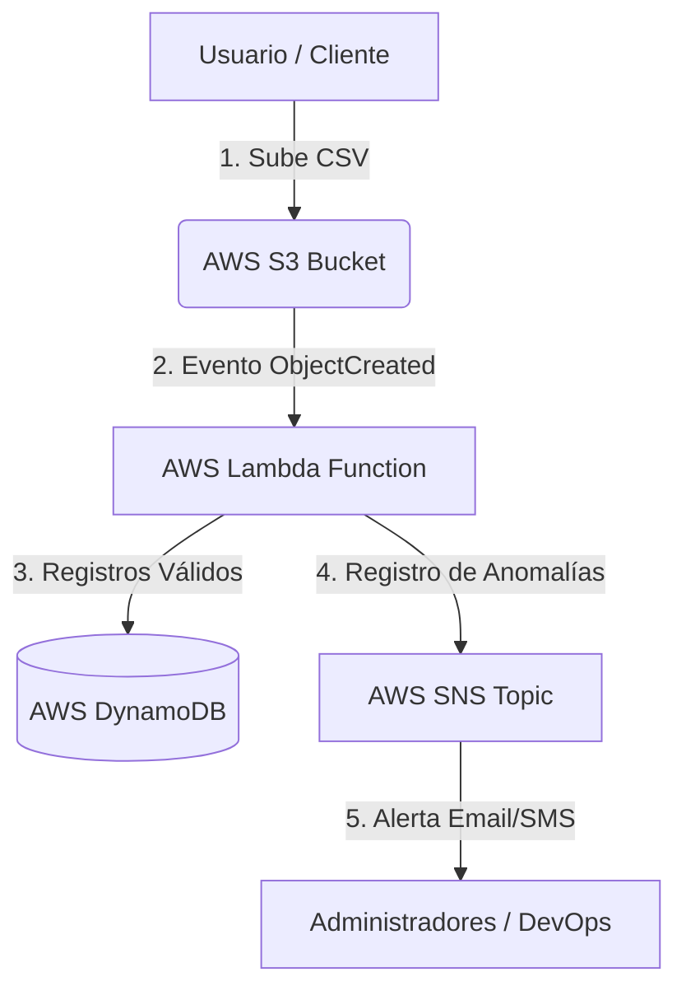

# Pipeline Serverless de Ingesta, Validación y Alertas de Datos en la Nube ☁️🚀

Este proyecto fue desarrollado bajo la metodología de **Aprendizaje Basado en Problemas (ABP)** para la materia **Seguridad y Computación en la Nube**. Resuelve la problemática empresarial del procesamiento tardío, manual e inseguro de transacciones masivas mediante una arquitectura serverless, elástica y de bajo costo.

---

## 👥 Integrantes del Equipo
| Nombre | Rol / Especialidad | GitHub |
| :--- | :--- | :--- |
| **Estudiante Académico 1** | Cloud Engineer | [@github-user1](#) |
| **Estudiante Académico 2** | Full-Stack Developer | [@github-user2](#) |

---

## 📝 Descripción del Problema
Muchas empresas procesan sus reportes de ventas o auditorías mensuales cargando manualmente archivos planos (`.csv`) a bases de datos relacionales sin validación previa. Este flujo manual expone el negocio a:
1. **Errores e inconsistencias de datos**: Registros corruptos (montos negativos, IDs vacíos, formatos de fecha rotos) que degradan la calidad del almacén de datos.
2. **Cuellos de botella de rendimiento**: Sobrecarga en servidores tradicionales durante las horas pico de carga de archivos.
3. **Ausencia de alertas**: Falta de mecanismos reactivos que alerten inmediatamente a los administradores de seguridad o analistas de datos si ocurre un error o fraude potencial.

---

## 🛠️ Solución Propuesta (Arquitectura Cloud)
La arquitectura implementa un **Pipeline Serverless** reactivo guiado por eventos, garantizando escalabilidad automática, alta disponibilidad y un esquema de costos basado 100% en el consumo real (Pago por uso).

### Diagrama de Arquitectura (Mermaid)



### Flujo de Datos
1. **Ingesta:** El usuario o sistema externo deposita un archivo CSV de transacciones en un bucket de **AWS S3**.
2. **Cómputo (Serverless):** El evento de creación del objeto dispara automáticamente una función **AWS Lambda** programada en **Python**.
3. **Validación:** El código parsea cada registro del CSV y lo valida (monto positivo, fecha `YYYY-MM-DD`, campos no vacíos).
4. **Persistencia:** Los registros limpios y validados son insertados de forma segura en **AWS DynamoDB** (NoSQL).
5. **Alerta Activa:** Si se detectan anomalías en el archivo (registros rotos, sospecha de manipulación), la función Lambda envía una alerta crítica de inmediato a través de **AWS SNS** (Simple Notification Service) por correo electrónico.

---

## 📂 Estructura del Repositorio
El repositorio contiene el código del backend serverless y una Landing Page interactiva con simulador local:

```bash
├── index.html              # Landing page principal con simulador interactivo
├── styles.css              # Estilos responsivos (modern SaaS look)
├── script.js              # Lógica interactiva y simulador del pipeline
├── src/
│   ├── lambda_function.py  # Código fuente Python 3.10+ de la AWS Lambda
│   └── sample_data.csv     # Dataset CSV de prueba (con errores integrados)
└── README.md               # Esta documentación
```

---

## ⚙️ Instrucciones de Despliegue en la Nube (AWS)

Sigue estos pasos para desplegar esta arquitectura de manera autónoma en tu cuenta de AWS:

### 1. Crear el Almacén NoSQL (DynamoDB)
1. Ve a la consola de **AWS DynamoDB** y haz clic en **Create table**.
2. Nombre de la tabla: `TransaccionesProcesadas`.
3. Partition key (Clave de partición): `id_transaccion` (String).
4. Deja el resto por defecto y selecciona **Create table**.

### 2. Configurar el Canal de Alertas (SNS)
1. Abre la consola de **AWS SNS** y haz clic en **Create topic**.
2. Tipo: **Standard**. Nombre: `AlertasTransacciones`.
3. Una vez creado, selecciona **Create subscription**.
4. Protocolo: **Email**. Endpoint: Tu correo electrónico.
5. Confirma la suscripción en el enlace que llegará a tu bandeja de entrada.

### 3. Crear la Función Serverless (Lambda)
1. Ve a **AWS Lambda** y haz clic en **Create function**.
2. Nombre: `IngestaValidacionPipeline`. Runtime: **Python 3.10** (o superior).
3. En la sección **Change default execution role**, crea un rol básico de ejecución.
4. Una vez creada la función, ve a la pestaña **Configuration -> Permissions** y haz clic en el nombre del rol. Añade permisos para:
   - Lectura en **S3** (`AmazonS3ReadOnlyAccess`).
   - Escritura en **DynamoDB** (`AmazonDynamoDBFullAccess` o políticas específicas).
   - Publicación en **SNS** (`AmazonSNSFullAccess`).

### 4. Cargar el Código de la Lambda
1. Copia el contenido de [lambda_function.py](file:///e:/UNIVERSIDAD/Catolica%20del%20Norte/SEMESTRE%204/Computaci%C3%B3n%20en%20la%20Nube/ProyectoCN/src/lambda_function.py) y pégalo en el editor de código en la consola de AWS Lambda.
2. Asegúrate de modificar los nombres del Bucket S3 y el ARN del Topic SNS correspondientes a tu despliegue.
3. Haz clic en **Deploy**.

### 5. Configurar el Disparador de S3 (Trigger)
1. Crea un bucket de **AWS S3** llamado `ingesta-transacciones-abp`.
2. En la consola de tu función Lambda, selecciona **Add trigger**.
3. Selecciona **S3** como origen, escoge el bucket creado, y tipo de evento `All object create events`.
4. Acepta los términos y haz clic en **Add**.

---

## 🖥️ Ejecución y Pruebas Locales

### Landing Page & Simulador Interactivo
No necesitas credenciales de AWS para testear la lógica. La landing page incluye un simulador escrito en Vanilla Javascript que emula el procesamiento exacto del backend serverless:

1. Simplemente abre el archivo [index.html](file:///e:/UNIVERSIDAD/Catolica%20del%20Norte/SEMESTRE%204/Computaci%C3%B3n%20en%20la%20Nube/ProyectoCN/index.html) en cualquier navegador web.
2. Podrás ver el problema, la arquitectura interactiva y el módulo del simulador.
3. Haz clic en **Iniciar Simulación de Pipeline** para validar el dataset por defecto.
4. Puedes editar los valores directamente en la caja de texto CSV para inducir nuevos errores y ver cómo reacciona el pipeline.

### Probar el Script de Python Localmente
Si deseas validar la ejecución de la función de Python en tu máquina local:
1. Instala Python 3.10+.
2. Ejecuta un script de prueba que importe la función (o añade un bloque `__main__` temporal) pasando como evento el string del CSV:
   ```python
   from src.lambda_function import lambda_handler

   test_event = {
       "csv_data": "id_transaccion,cliente,monto,fecha\\nTX-1001,Juan,10.0,2026-08-01\\n,Invalido,-5,2026/08/02"
   }
   response = lambda_handler(test_event, None)
   print(response["body"])
   ```
